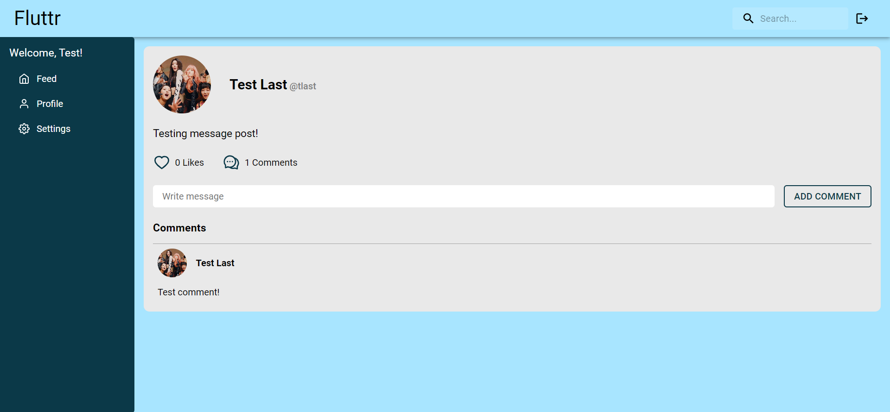

# Fluttr 
## A Social Application

Welcome to Fluttr! This application uses a React front end, an AWS RDS database, Node js & a Spring backend. The application was created for users of all shapes and sizes to come online and share their thoughts on whatever they may feel needs to be expressed. Users can follow others that they may find interesting to have that users posts appear on their feed. Posts will appear on the following feed in an order based on the most recent post created. This application allows users to connect with like-minded individuals to share their thoughts, like posts they enjoy, and comment on posts they wish to interact with. The goal of this application is to connect users around the globe with people they would have otherwise never been able to meet in real life. We hope you enjoy Fluttr as much as we enjoyed creating it for you! 

## Deployed Application

http://flutterdeployedbucket.s3-website-us-east-1.amazonaws.com/

## Backend Repository
https://github.com/socialbee-b/fluttrbackend

## Tehcnologies Used

- TypeScript
- React
- Node.js
- Java
- Spring
- AWS 
    - S3 
    - RDS
    - BeanStalk
    - Pipeline
    - EC2
- JUnit Testing
- Mockito Testing

## Homepage

